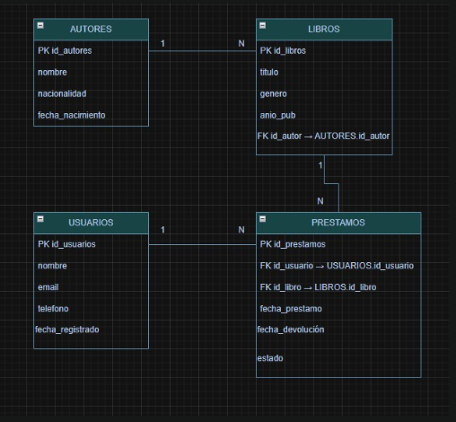

Este proyecto es una aplicación sencilla hecha con Express que simula el funcionamiento básico de una biblioteca usando rutas separadas para organizar mejor el código. Aquí se manejan autores, libros y préstamos, cada uno guardado en arreglos en memoria, lo que significa que los datos se mantienen mientras el servidor esté encendido. En las rutas de autores se puede consultar un autor por su id, agregar uno nuevo, actualizar su información o eliminarlo si existe; si no se encuentra, se responde con un mensaje claro indicando que no fue encontrado. En las rutas de libros se puede ver la lista completa, buscar un libro por id, crear uno nuevo, editarlo o eliminarlo, siempre validando si realmente existe antes de hacer cambios. En las rutas de préstamos se puede consultar un préstamo por id, crear uno nuevo, modificarlo o eliminarlo, siguiendo la misma lógica de verificación. Finalmente, el archivo principal configura el servidor, activa el uso de datos en formato JSON, conecta todas las rutas bajo direcciones como /libros, /autores y /prestamos, y levanta la aplicación en el puerto 3000 mostrando en consola que el servidor está funcionando. En conjunto, el proyecto permite realizar operaciones básicas como crear, consultar, actualizar y eliminar datos, mostrando cómo organizar una API simple de manera clara y ordenada

# API Biblioteca

## Descripción

Este proyecto consiste en el desarrollo de una API básica para la gestión de una biblioteca.
La API permite administrar información sobre **usuarios, autores, libros y préstamos**, utilizando una base de datos SQLite.

El sistema crea automáticamente las tablas necesarias y agrega datos de prueba para poder visualizar información dentro de la base de datos.

---

## Tecnologías utilizadas

* Node.js
* SQLite
* JavaScript

---

## Base de datos

Se utiliza una base de datos llamada **database.db**, la cual se crea automáticamente cuando se ejecuta el proyecto.

La base de datos contiene las siguientes tablas:

### 1. Usuarios

Guarda la información de las personas registradas en la biblioteca.

Atributos:

* id_usuario (PK)
* nombre
* email
* telefono
* fecha_registro

---

### 2. Autores

Contiene información sobre los autores de los libros.

Atributos:

* id_autor (PK)
* nombre
* nacionalidad
* fecha_nacimiento

---

### 3. Libros

Almacena los libros disponibles en la biblioteca.

Atributos:

* id_libro (PK)
* titulo
* genero
* anio_publicacion
* id_autor (FK)

Relación:

* Un autor puede tener varios libros (1:N).

---

### 4. Préstamos

Registra los préstamos de libros realizados por los usuarios.

Atributos:

* id_prestamo (PK)
* id_usuario (FK)
* id_libro (FK)
* fecha_prestamo
* fecha_devolucion
* estado

Relaciones:

* Un usuario puede tener varios préstamos (1:N).
* Un libro puede aparecer en varios préstamos (1:N).

---

## Datos de prueba

El sistema inserta automáticamente información de ejemplo en las tablas:

Autores:

* Gabriel García Márquez
* J.K. Rowling
* George Orwell

Usuarios:

* Juan Perez
* Maria Gomez
* Carlos Ruiz

Libros:

* Cien años de soledad
* Harry Potter y la piedra filosofal
* 1984

También se agregan registros de préstamos para poder probar la base de datos.

---

## Funcionamiento

Al ejecutar el proyecto:

1. Se conecta a la base de datos SQLite.
2. Se crean las tablas si no existen.
3. Se activan las llaves foráneas para relacionar las tablas.
4. Se insertan datos de prueba.
5. Se exporta la conexión de la base de datos para ser utilizada en otros archivos del proyecto.

---

## Autor

Proyecto desarrollado como práctica para el manejo de bases de datos y APIs con Node.js.

